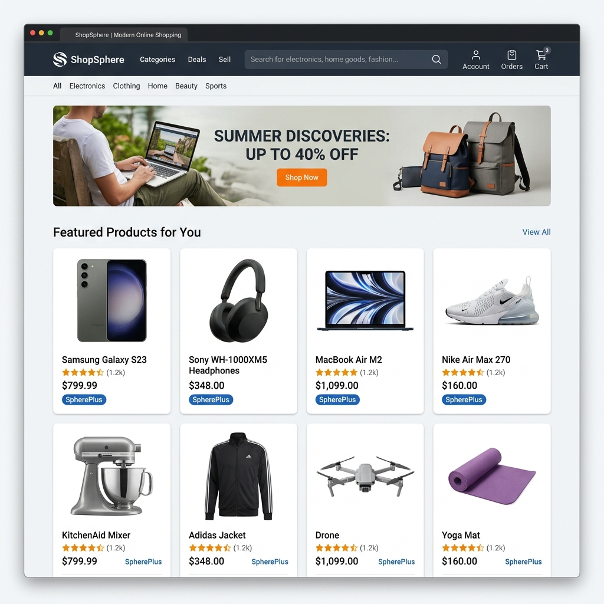
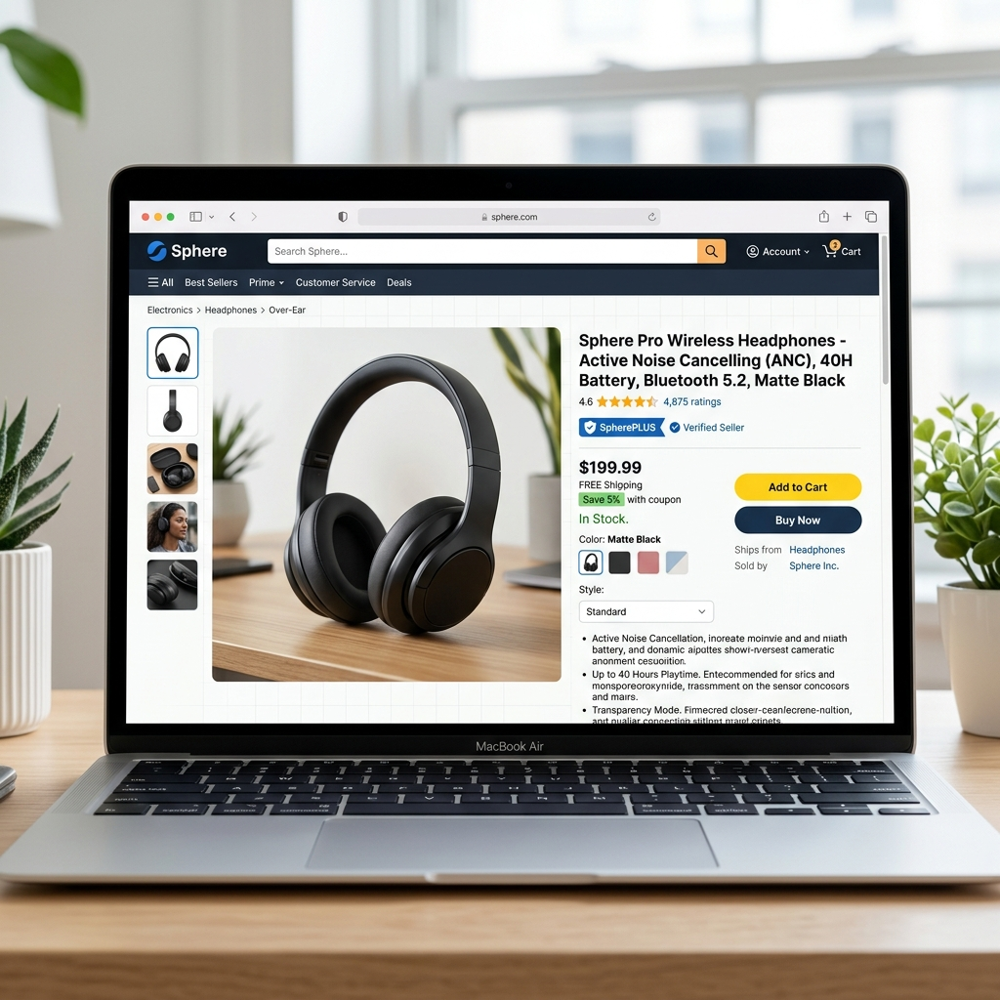

# ShopSphere Salesforce App 🛒



A production-quality, Amazon-inspired ecommerce application built natively on the Salesforce platform using **Lightning Web Components (LWC)** and **Apex**. ShopSphere is designed to be an enterprise-grade portfolio project showcasing modern UI/UX design patterns, scalable data architecture, and deep Salesforce platform integrations.

## 🌟 Key Features

*   **Pixel-Perfect Amazon UI:** A dark, sleek mega-header, glassmorphism product cards, and meticulous CSS styling to replicate a high-end ecommerce experience.
*   **"SpherePlus" Delivery Mocking:** Amazon Prime-style delivery estimations, stock status indicators, and exclusive branding badges.
*   **Dynamic Product Detail Pages (PDP):** Includes a side-mounted interactive thumbnail gallery, comprehensive features lists, and an embedded "Similar Items" AI carousel.
*   **Interactive Orders Tracking:** A fully functional "Returns & Orders" profile UI with simulated 4-step delivery tracking progress bars.
*   **Real-time Cart & Multi-step Checkout:** Dynamic cart counter, subtotal calculations, and a complete mock checkout flow with toast notifications.
*   **Agentforce AI Integration:** Mocked AI product recommendations built directly into the Salesforce Service layer.
*   **Perceived Performance Skeletons:** Animated CSS shimmer loaders that fetch data asynchronously to keep the UI incredibly fast and responsive.

---

### Product Detail Page (PDP) Experience


## 🛠️ Architecture

*   **Frontend (LWC):** 12+ highly modular Lightning Web Components managing state, navigation, and rendering. 
*   **Backend (Apex):** Built using the enterprise **Selector Pattern** (e.g., `ProductSelector`, `OrderSelector`) to encapsulate SOQL and keep controllers lean and secure.
*   **Security:** Leverages Custom Objects, Profiles, and Permission Sets (`ShopSphere_Full_Access`) to govern data access.

## 🚀 Setup Instructions

1.  **Authenticate** with your Salesforce Dev Hub:
    ```bash
    sf org login web -d -a DevHub
    ```
2.  **Deploy** to your target Org (or Scratch Org):
    ```bash
    sf project deploy start
    ```
3.  **Assign Permission Set** to your admin user:
    ```bash
    sf org assign permset -n ShopSphere_Full_Access
    ```
4.  **Load Sample Data** via Anonymous Apex:
    ```bash
    sf apex run -f scripts/apex/sample_data.apex
    ```

## 📜 License
This project is for educational and portfolio purposes. It does not use official Amazon trademarks or copyrighted imagery.